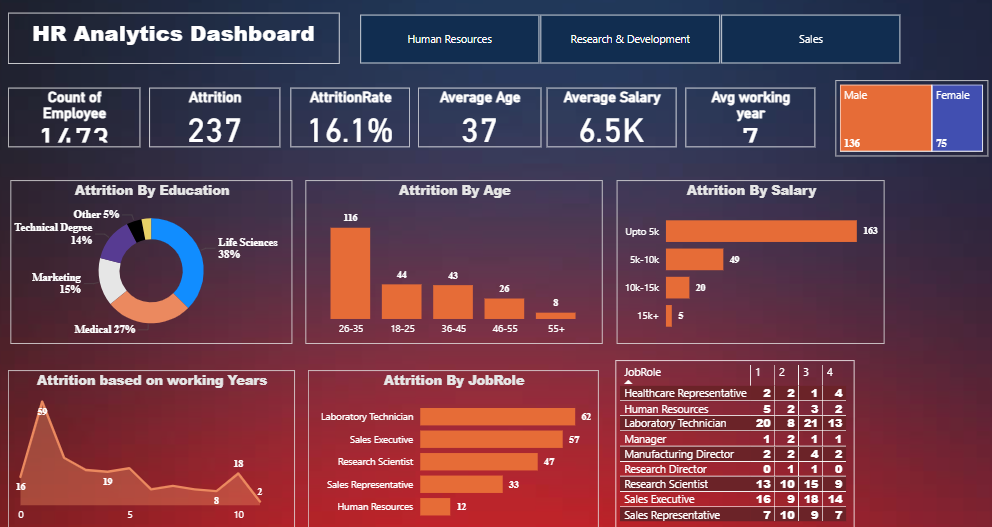

# HR Analytics Dashboard (Power BI)

This project is a Power BI dashboard that analyzes HR data to identify trends in employee attrition based on age, salary, education, job roles, working years, and more.

## 📊 Dashboard Features
- Attrition Rate, Total Attrition & Employee Count
- Filter by Department (HR, Sales, R&D)
- Attrition by Age, Salary, Job Role, Working Years
- Education, Marital Status, and Gender Breakdown

## 🛠️ Tools Used
- Power BI (Data Visualization)
- DAX (for custom measures)
- Excel (as a data source)

## 📷 Screenshot

## 📁 File Info
- `HR_analytics.png` - Image preview of the dashboard
- `HR_Analytics.xlsx` - Excel file of data
- `HR analysis using PowerBi.pbix` - PowerBi file

## 🔗 Explore More Projects
👉 Check out my complete portfolio: (https://portfolio-three-eta-35.vercel.app)
---
